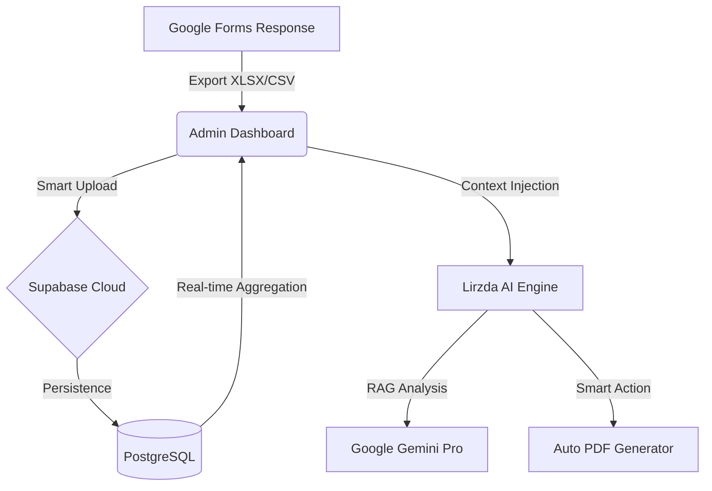

# 📊 CSAT Dashboard — Cakrawala University

**"Empowering Academic Excellence through Intelligent Data Analytics"**

[](https://reactjs.org/)
[](https://vitejs.dev/)
[](https://supabase.com/)
[](https://ai.google.dev/)

Dashboard analisis kinerja dosen berbasis feedback mahasiswa yang bertransformasi menjadi platform **Enterprise Intelligence**. Sistem ini mengintegrasikan data real-time, persistensi cloud, dan kecerdasan buatan untuk membantu Program Studi melakukan evaluasi akademik yang presisi, objektif, dan proaktif.

---

## 🏗️ Arsitektur & Ekosistem Sistem

Sistem ini dirancang dengan arsitektur **Modern Full-Stack** yang memisahkan antara _Data Acquisition_, _Cloud Storage_, dan _AI Processing Layer_.



---

## ✨ Fitur Unggulan (Comprehensive)

| Kategori            | Fitur                   | Keterangan                                                                                           |
| :------------------ | :---------------------- | :--------------------------------------------------------------------------------------------------- |
| 🤖 **Intelligence** | **Lirzda AI Engine**    | Analisis data berbasis Gemini Pro yang paham konteks file, dosen, hingga anomali.                    |
| 🦾 **Automation**   | **Action Protocol**     | Lirzda dapat mengunduh laporan PDF secara otomatis berdasarkan perintah chat Anda.                   |
| ☁️ **Persistence**  | **Supabase Cloud Sync** | Penyimpanan data persisten; data aman di cloud tanpa perlu upload ulang setiap refresh.              |
| � **Analytics**     | **Anomaly Detection**   | Identifikasi otomatis penurunan performa atau volatilitas tinggi menggunakan Z-Score.                |
| � **Visualization** | **Dynamic Charts**      | Grafik Radar Kompetensi, Tren Pertemuan, dan WordCloud Sentimen mahasiswa.                           |
| � **Acquisition**   | **Smart Upload**        | Pendeteksian kolom otomatis (Auto-mapping) untuk file XLSX, XLS, dan CSV.                            |
| 🏆 **Performance**  | **Ranking & Detail**    | Tabel peringkat sortable dan profil detail dosen dengan analisis kompetensi mendalam.                |
| � **Experience**    | **Hybrid UX**           | Chatbot _draggable_ di desktop, _full-screen overlay_ di mobile, dan dukungan **Dark Mode** premium. |
| 📄 **Reporting**    | **Granular Export**     | Export laporan profesional ke PDF (per dosen/kelas) dan rekap data ke Excel.                         |

---

## 📁 Struktur Project Terbaru

```text
csat-dashboard/
├── src/
│   ├── components/
│   │   ├── ai/AIChat.jsx      ← UI Assistant (Draggable & Responsive)
│   │   ├── charts/            ← Library visualisasi (Recharts & WordCloud)
│   │   └── pages/             ← Halaman utama (Dashboard, Ranking, Anomali, dll)
│   ├── lib/
│   │   ├── store.js           ← Manajemen State Global & Cloud Sync Logic
│   │   └── supabase.js        ← Konfigurasi & Inisialisasi API Supabase
│   ├── utils/
│   │   ├── aiUtils.js         ← Prompt Engineering & Action Logic Lirzda
│   │   ├── analytics.js       ← Engine kalkulasi CSAT, Z-Score, & Agregasi
│   │   └── exportUtils.js     ← Engine pembuat laporan PDF & Excel
│   └── App.jsx                ← Root component & routing
└── supabase_schema.sql        ← Blueprint database PostgreSQL untuk Supabase
```

---

## 🧠 Metodologi & Algoritma Analisis

### 1. Perhitungan Skor CSAT (Customer Satisfaction Score)

Sistem menggunakan rata-rata terbobot dari tiga pilar utama evaluasi:
$$CSAT\_Gabungan = \frac{Pemahaman + Interaktif + Performa}{3}$$
Setiap aspek dinilai pada skala 1-5 oleh mahasiswa.

### 2. Deteksi Anomali (Z-Score & Variansi)

Untuk mengidentifikasi performa yang luar biasa atau yang memerlukan perhatian (drop), sistem menghitung penyimpangan statistik ($Z$):
$$Z = \frac{x - \mu}{\sigma}$$

- **High Anomaly**: Variansi $> 1.0$ (Indikasi feedback mahasiswa sangat terpolarisasi).
- **Performance Drop**: Penurunan skor $> 0.4$ antar pertemuan.

### 3. NLP & Word Cloud (Sentiment Analysis)

Menggunakan algoritma pembersihan teks (Junk Filter) dan ekstraksi kata kunci untuk memetakan "Topic Gap" (materi yang paling tidak dipahami mahasiswa).

---

## 🤖 Lirzda AI: Asisten Proaktif

**Lirzda** bukan sekadar chatbot, ia adalah agen yang memiliki akses ke:

- **Deep Search Context**: Melakukan query mendalam ke seluruh histori data dosen yang disebutkan.
- **Smart Action Protocol**: Memicu perintah sistem (seperti unduh PDF) secara otomatis via deteksi tag `[ACTION]`.
- **Lirzda Memory**: Menyimpan preferensi dan fakta unik tentang dosen di tabel `lirzda_memories` untuk pembelajaran berkelanjutan.

---

## 💾 Model Data (Database Schema)

Sistem menggunakan database relasional di Supabase dengan skema berikut:

- **`lecturers`**: Menyimpan identitas unik dosen.
- **`subjects`**: Katalog mata kuliah dan kode kelas.
- **`csat_data`**: Tabel utama berkapasitas tinggi untuk menyimpan ribuan baris feedback.
- **`lirzda_memories`**: Tabel "Ingatan" AI untuk menyimpan fakta-fakta hasil pembelajaran.
- **`ai_cache`**: Optimasi performa untuk menyimpan jawaban AI yang serupa.

---

## � Instalasi & Konfigurasi

### Prasyarat

- Node.js (v18+)
- Akun Supabase (Gratis)
- Google AI Studio API Key (Gemini)

### Langkah Setup

1. **Clone Repositori**

   ```bash
   git clone https://github.com/adzriladzim/csat-dashboard.git
   cd csat-dashboard
   ```

2. **Environment Variable (`.env`)**

   ```env
   VITE_SUPABASE_URL=https://hahahihi.supabase.co
   VITE_SUPABASE_ANON_KEY=eyJhbG...
   VITE_GEMINI_API_KEY=AIzaSy...
   ```

3. **Database Setup**
   Jalankan query di `supabase_schema.sql` pada SQL Editor Supabase Anda untuk membuat tabel dan kebijakan keamanan (RLS).

---

## � Responsivitas & UX Premium

- **Mobile First**: Dashboard dan Chat Lirzda dioptimalkan untuk perangkat layar kecil dengan mode full-screen overlay.
- **Desktop Pro**: Chat Lirzda bersifat _draggable_ (bisa dipindah-pindah) agar tidak menutupi grafik utama.
- **Zero Maintenance**: Fitur _Auto-Sync_ otomatis membersihkan dan memperbarui cloud setiap kali ada unggahan data baru.

---

## 📄 Lisensi & Penggunaan

Sistem ini bersifat Open Access untuk keperluan internal **Cakrawala University**. Dikembangkan dengan dedikasi untuk peningkatan standar kualitas pendidikan tinggi di Indonesia.

---

**Dibuat oleh Adzril Adzim Hendrynov**  
_Membangun Masa Depan Pendidikan dengan Kecerdasan Data._ 🎓🚀
